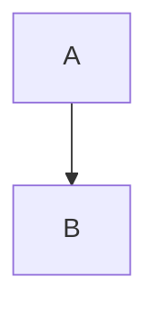

# itgowolib
一个APP工具集，包含非常规方法，依然简单不依赖第三方

```mermaid
graph TD
   A --> B
```

```flow
st=>start: Start
op=>operation: Your Operation
cond=>condition: Yes or No?
e=>end
st->op->cond
cond(yes)->e
cond(no)->op
```
